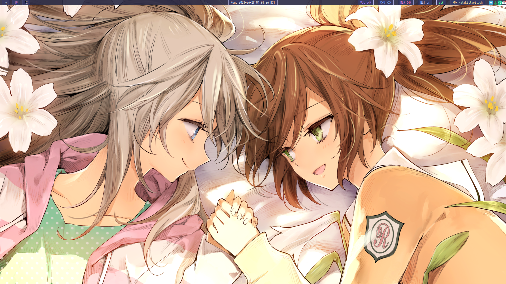
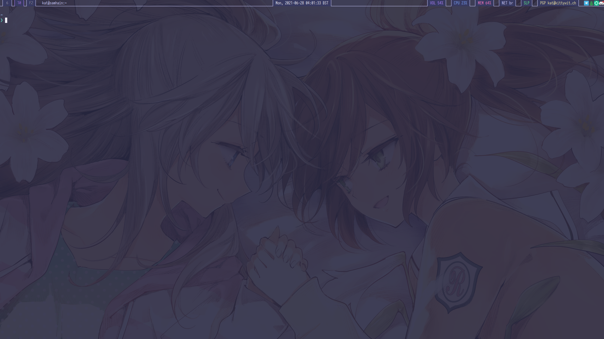
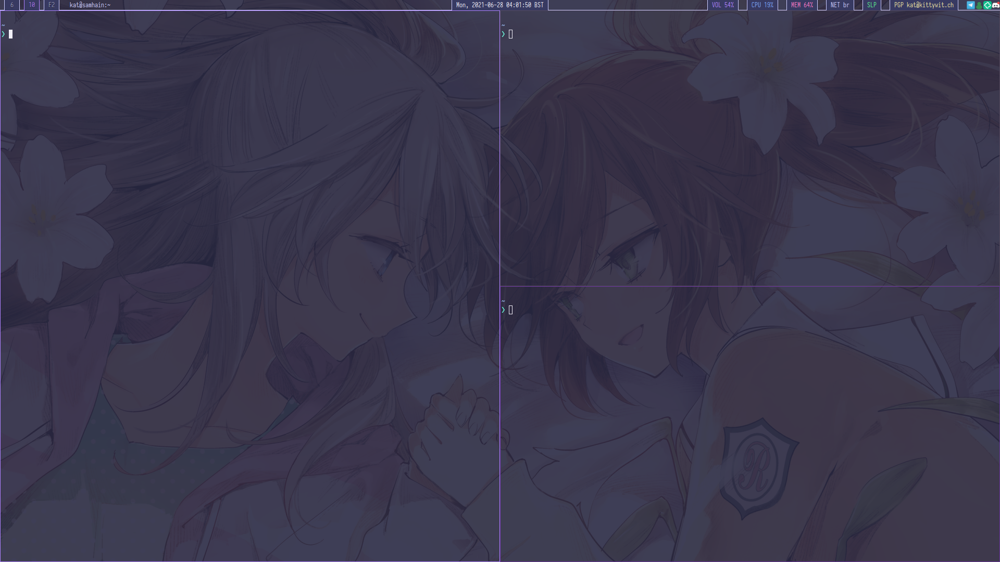
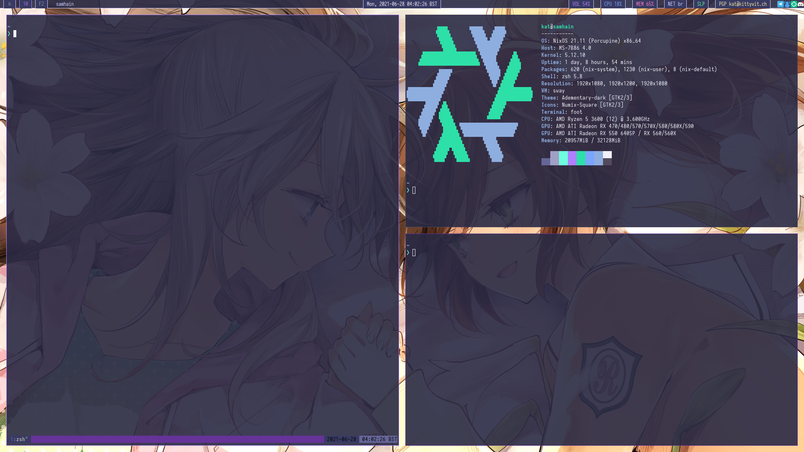

We did some work on our sway+waybar setup and moved to [foot](https://codeberg.org/dnkl/foot).

Tomorrow will be moving to wofi, updating foot and submitting a PR for it to nixpkgs.

## Clean:

## One Window:

## No Gaps, Several Terminals:

## Gaps, Several Terminals and Neofetch:

## Wallpaper

[Wallpaper at time of screenshot](https://konachan.com/image/cd53e508821234869ec0d38355860179/Konachan.com%20-%20148515%202girls%20aeba_seri%20blue_eyes%20brown_hair%20flowers%20gray_hair%20green_eyes%20kodoku_ni_kiku_yuri%20konno_fusa%20minakata_sunao%20ponytail%20shoujo_ai..png)

