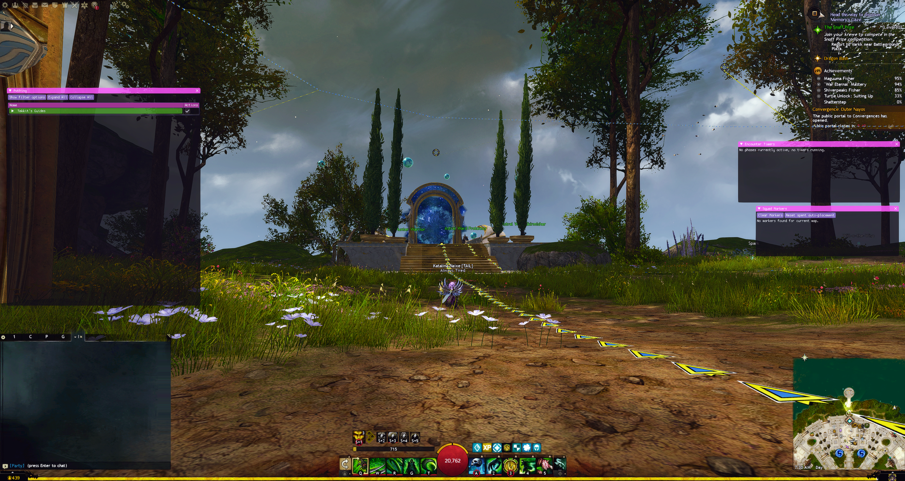
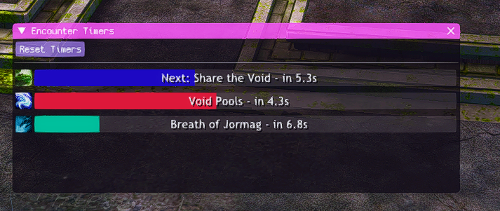
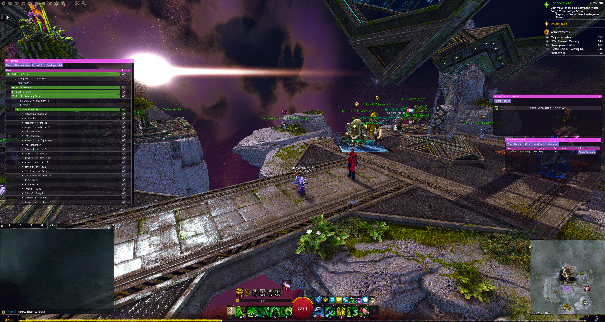
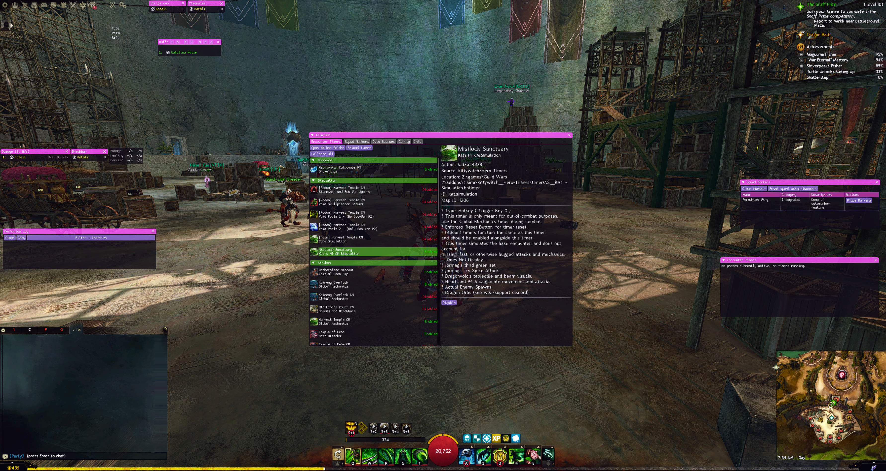
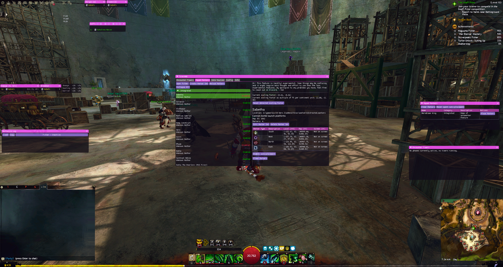
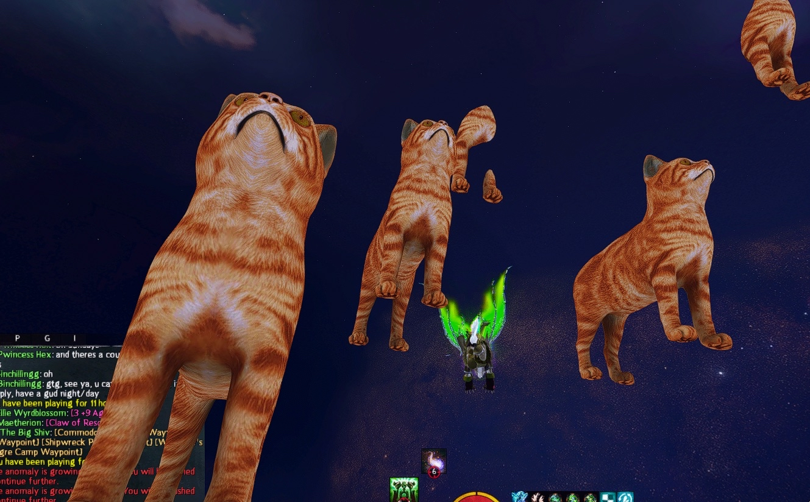
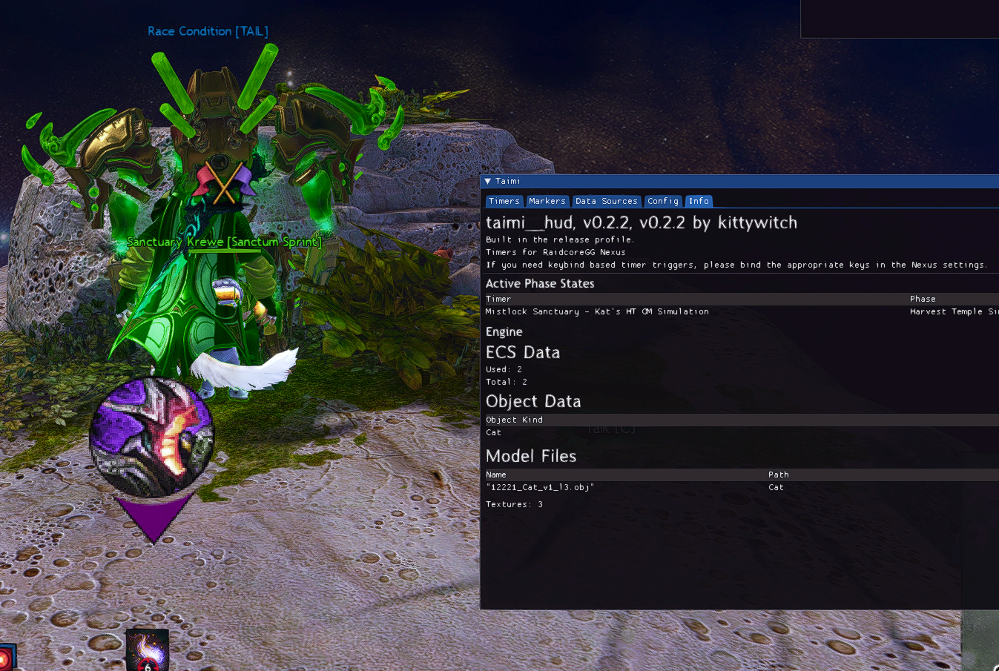

## An unbelievable quantity of thanks to:

* Sarah, my beloved friend, for:
  * inspiring this whole mess with a conversation
  * continued inspiration with markers, rendering
  * being there for me
  * advice
  * putting up with me
* [arcnmx](https://github.com/arcnmx), my wife, for:
  * supporting me in many ways during this period
  * helping me with Rust
  * being a wonderful contributor/co-author
  * being an absolute darling
  * putting up with me
* [Connicpu](https://github.com/Connicpu), for:
    * taking the torch and doing an amazing job with Pathing
    * being a wonderful contributor/co-author
* E for Effort [SIGH], my guild, for putting up with my bullshit
* deltaconnected, for creating [arcdps](https://www.deltaconnected.com/arcdps/)
* Delta, for creating [Nexus](https://raidcore.gg/Nexus) and confusion with deltaconnected ;)
* Zerthox, for creating [Zerthox/nexus-rs](https://github.com/zerthox/nexus-rs) and [Zerthox/arcdps-rs](https://github.com/zerthox/arcdps-rs)
* those who are testing or have tested TaimiHUD

## Screenshots

## Introduction

Repositories:

* Personal: [kittywitch/TaimiHUD](https://github.com/kittywitch/TaimiHUD)
* Organization: [TaimiHUD/TaimiHUD](https://github.com/TaimiHUD/TaimiHUD)

For the longest of time, I've felt like that Windows users have a far superior experience of GW2 with addons than Linux users do. This is a real shame, given the amount of people who could play now from a Steam Deck, let alone daily-drive Linux to avoid the horrors of modern Windows. The Windows users had BlishHUD and its modules to turn to.

The things that irked me most were the accessibility challenges, I found myself longing for things like:

* encounter timers
* auto marker placements
* pathing for achievements, races, ...

Inspired by a beloved friend, I began work on the above one goal at a time.

I had prior made a [Nexus](https://raidcore.gg) addon for Guild Wars 2, [gw2buttplug-rs](https://github.com/kittywitch/gw2buttplug-rs) that facilitated output for buttplug.io via DPS-metering with the help of my wife to get me started with it, as my first GW2 Rust project.

## Timers

Milestone by milestone, I reimplemented Timers following the same data format as BlishHUD's, so I could load Hero's Timers Pack, until eventually we had everything but Bandit Trio working.

Bandit Trio seems to not work due to perculiarities of how the Bandit Trio timer itself works, which will eventually require a complete change of how Timers are handled under the hood, to properly support health/HP/CC event triggers.

## Licensing

I decided to license the project MIT, to allow the community the freedoms over the software that they rightfully deserve.

## 3D rendering

I started work on a DX11 rendering engine for the game and got to the point of having models load and a billboarded marker from Timers working.

It was at this point that I went to attend to Commander's Markers!

## Commander's Markers

With Timers handled, Commander's Markers was next on the chopping block, two formats to support and my own to be created. I even made it so that it automatically places it based upon a location trigger, and drags the minimap for you if it can.

## Pathing?

By this point the source code was very available, and an experienced Rust developer called [Connie](https://github.com/Connicpu) showed interest in working on the codebase for the purposes of Pathing. At first, with a trail, and very recently POIs. I couldn't be happier that this is no longer a solo effort, given how much of my time the last several months this has been.

My wife also made contributions to the codebase; providing Pathing with the depth buffer stolen from the game via Retour, alongside refactoring the addon to be compatible with being loaded by either Nexus *or* ArcDPS.

Given the way this continues, I want to migrate all development into a GitHub organization and set up a community in our own right, hopefully refactoring TaimiHUD into a set of addons and libraries.

## Nexus, ArcDPS and arcloader

Delta (the author of Nexus, not to be confused with deltaconnected, the author of ArcDPS (not to be confused with arcnmx, my wife)) has been a relatively accomodating addon loader creator, although we have our share of disagreements. In Nexus's future, I would like to see it licensed under a proper open-source license, instead of simply being source-available, whether or not I think the codebase is the epitome of what it could necessarily be.

Often, it feels like decisions are relatively slapdash, disconnected from the context or potential use an addon might have for things... an example of this would be textures being a shared asset amongst addons, thus never being unloaded/garbage-collected/..., causing "memory leaks" should one use Nexus's own texture loader implementation for their code.

Given that Raidcore's own internal project on Pathing for the last year has been a ...gentle fiasco in its own right, I do find the closed-source nature of those developments upsetting. At least if they had shared our paradigm, someone else would be able to take the torch and continue the work that needs doing, working from the source-code, however low the author's own opinions of it are?

My wife has a lot of opinions on the current state of Nexus, and I think she should make a blogpost of her own to talk about them in detail. Her work in wanting to be able to load TaimiHUD without using Nexus led to her own project, [arcloader](https://github.com/arcnmx/arcloader) and I think it's very cute! (it's also MIT licensed 💜💜💜, what a chad!)

## Long-term

As I said prior; I would like to see TaimiHUD turned into a set of addons and libraries, this would probably be along the lines of:

* coordinates conversion library
* coordinates conversion API DLL
* 3D rendering library
* 3D rendering API DLL
* Pathing component addon
  * non-optional requirement for 3D rendering
* Markers component addon
* Timers component addon
  * optional 3D rendering use for Directions, Markers

I think it would also be ideal to keep this detatched from any one particular modloader?

I have a fondness for my wife's arcloader, and would like to see it a project under our umbrella, we would ideally be more arcloader-centric in the future if it continues development, but I have no interest in being attached at the hip to any one modloader.

My wife contributed us the revamp to support ArcDPS and I see no reason why we should not continue to support any reasonable loader options in future.

### Community

Look out in the near future! I will likely be making a discord and so on for this project.
