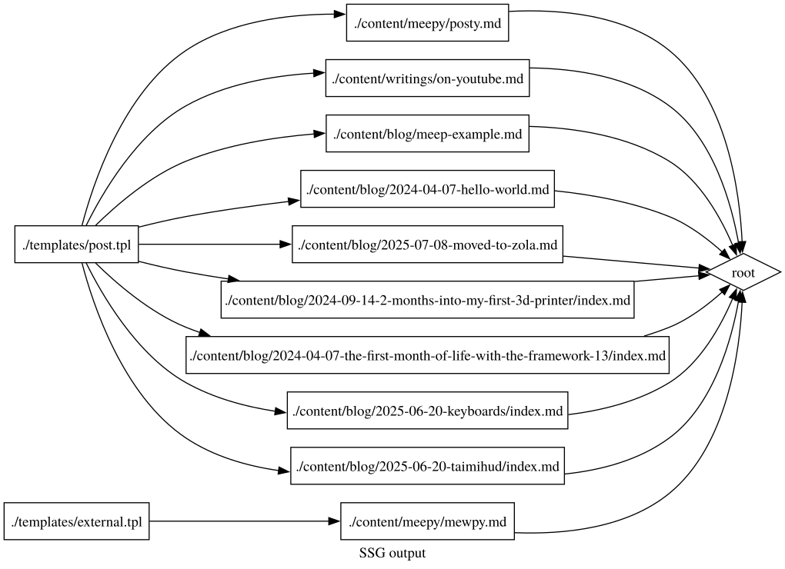

## Why did I decide to abandon Zola?

I'd not long since switched from Carbon to Zola and added the `external/` page to dork.dev (which at the time of writing this, still needs to be replaced on Kusachi). Here are some of my problems with Zola!

### Template syntax verbosity to achieve relatively simple aims

#### Title handling

```html
<title>
    
    {{ section.title }} -
    
    {{ page.title }} -
    
    {{ config.extra.site_title }}
</title>
```
The title syntax highlights the level of verbosity one can expect if one wants their base templates to be reusable across multiple kinds of page. From my point of view, this happens because much of what is decided is as a result of the "context" of a template; the scope provided onto it.

Now, Zola does have a way for me to set a consistent variable to be used elsewhere within the page or such; ``, but this does not reduce any verbosity, it simply de-duplicates the verbosity.

The way I handle this (in Kusachi) is simple; the call to template something is just a function call! The title is a parameter in the function call. Where that is not concrete (see all posts); they have a placeholder to take my frontmatter title later in the pipelining (because with an interpreter-like).

#### Data loading and optionals

So, I liked to showcase external posts on the last iteration of my website, here's a little look at the complexity of doing so, just loading from a TOML file with some optional values.

```html


    <section>
        <h3>{{ category.title }}</h3>
        
        <p>{{ category.note | markdown(inline = true) | safe }}</p>
        
        <ul>
            
                <li>
                  <article>
                      <a href="{{post.permalink | safe}}"><strong>{{ post.title }}</strong></a>
                       by {{ post.author }} - <a href="{{post.archive}}">Archive</a>  ({{ post.suffix }})
                  </article>
                </li>
            
        </ul>
    </section>

```

Once again, we see some potential verbosity where optionals are concerned. One could contemplate any manner of syntactic sugar for this if one so desired but evidently, there was not any here.

### Image processing

<div class="quote">
<blockquote cite="https://www.getzola.org/documentation/content/image-processing/">
Zola provides support for automatic image resizing through the built-in function `resize_image`, which is available in template code as well as in shortcodes.

The function usage is as follows:

```
resize_image(path, width, height, op, format, quality, speed)
```

### Arguments

`path`: The path to the source image. The following directories will be searched, in this order:

- `/ (the root of the project; that is, the directory with your config.toml)`
- `/static`
- `/content`
- `/public`
- `/themes/current-theme/static`

</blockquote>
<cite>[Image processing | Zola](https://www.getzola.org/documentation/content/image-processing/)</cite>
</div>


I like to keep my posts that have images in a separate subfolder of their parent. This is to keep the whole structure of my project less messy and indirect with references; images for a post go with the post markdown! It makes it easier to link to too.

The way the image processing system within Zola works, no context of the caller is being provided to the image resizer function, it also doesn't search the nested file structure for the path at all other than what is said above. This means that unless I want to put my files in `content/` or `public/`, I'm shit out of luck for maintaining my ideal for how I would like my blog structured while maintaining the thumbnailing / image processing. Of course, I could've used an external image processing pipeline but then why have one in the static site generator at all? D:

This for me was the last straw!

### Conclusion on Zola

I have come to understand that I personally really don't like the kind of static site generators that insist upon using configuration to make up for the fact that their code is no longer *truly* extensible for the end user. Where the function call stack is not yours to mutate, you are in deep need of liberation.

## Inspiration and motivation; jyn514/flower

Exploration started with being told about [jyn514/flower](https://codeberg.org/jyn514/flower/src/branch/dev) by a dear friend, which I thought was very cool, but after a while I had decided was not ultimately what I wanted to pursue using.

For one, it would've required exiting my usual way of existing at least partially (I live in Nix's cage) and did not want to deal with a vendored build system and having to figure out building the underlying executable within Nix-land.

The idea of build system orchestration (a "meta build system") is appealing, but for me personally I feel any distinction between the static site generator and the site (provided here by the distinction of a "flower" binary at all) is something I would personally find undesirable, even if the utmost care and effort has been put in to avoid making this problematic for the end-user. I don't *particularly* need the fancy templating system espoused, as neat as it is! I like the hiccup/huff syntax just fine, and if I don't, I would personally like to make something myself that suits my needs.

I think the project, its goals and execution are however, *very* laudable; it's clear to me that my needs or wants from such a thing are not entirely the same.

## The journey

### The initial experiment; Luau on Lune (glade)

[Repository](https://github.com/kittywitch/glade)

This was my first attempt, a pandoc-utilizing site generator written using Lune and Luau that represented relationships between files in a directed acyclic graph. It was going well up until I found issues with self-convertibility in nested generics structures with type-checking set to strict.

I could've avoided using [CompeyDev/rusty-types](https://github.com/CompeyDev/rusty-luau/) but I really like Option<T> style interfaces, moreso than T? in Luau. Particularly because nil is a special-cased value in a multitude of cases, particularly within iteration.

The intention was to have the capacity to express both transformation of file paths and files themselves separately from one another, with Lune itself recommending one not to in fact reimplement everything as a Luau library, but being willing to call out to the shell; so preprocessors via the shell it is, pandoc will do!

The graph itself was built with file-based rules that expressed dependencies upon additional processes at runtime, e.g. a markdown post demands a template, a template demands its own compilation, the site root demands all of this to output a file.

<aside>


i also thought it was super cute to have [graphviz](https://graphviz.org/) generate an <abbr title="Scalable Vector Graphics">SVG</abbr> of the dependency <abbr title="Directed acyclic graph">DAG</abbr> once it was formed :3

</aside>

This was my attempt at "static site generator as build system in a dynamic language"; I liked it but it made for additional complexity in graph creation that I felt wasn't sufficiently isolated from the end user. Equally, a templating system which allowed for embedded expression evaluation and variable interpolation was present within this project.

I think a lot lately about [Fennel](https://fennel-lang.org/) and how one can have a Lisp that uses Lua as a compile target.

This project was surprisingly close to being done and I think without Luau/Lune I would've just completed it and called it a day, so... yay, type systems? ~~Who knew extrinsic type systems were so complicated?~~ All that would've been required to get a working project out of it was implementing the graph traversal to produce the site output.

### A shift to experimenting with dynamic websites

#### Gleam on BEAM & Dream (fauna)

[Repository](https://github.com/kittywitch/fauna)

The static type-checking at compile time meaning that hot-reloading is not plausible while maintaining the type safety of the whole program made a vast majority of the work I was doing with Gleam pointless, given that in comparison to dynamic languages on the BEAM, it would be ignoring the advantages of the BEAM VM and paradigms espoused by other BEAM languages.

I also look down upon the people who made Dream, despite it being somewhat better than the alternatives (in that it provides websocket support). This is mostly for [this issue](https://github.com/TrustBound/dream/issues/31). I love to ship my library with AI-written documentation, wholly unchecked and with *if statements in a language that entirely lacks them!* Not very poggers, not very poggers at all.

I however, did manage to implement a hot-reloading website in Gleam regardless. It was a somewhat enjoyable experience other than the fact that BEAM languages need a library with non-BEAM components in order to be able to close stdin separately from stdout and stderr. Issues remained there with many of the libraries either not being finished or being unmaintained.

#### Elixir & Phoenix (animalia)

[Repository](https://github.com/kittywitch/animalia)

I found Phoenix interesting, but it could not be more than a curiosity given the way it requires you to work around all of its base to get away from things like Tailwind CSS. I don't really like the implications of Tailwind CSS in general and a lot of its users are LLM users and vibe coders. There's nothing wrong with using it outright per say, but it isn't for me.

That amount of work required to cut it out of everything any time you so much as interact with new potential pieces to integrate really soured me on it. I think Tailwind CSS is a poor default for Phoenix, even if it helps many others be productive, that sort of thing is truly too "frameworky", I like to have to put the batteries in myself, I guess?

I still have a to-do for exploring Elixir without Phoenix, since it seems interesting.

#### Haskell & Servant (Unreleased)

Haskell didn't feel like a good fit overall, but it was nice to play with and I will probably be back for it to sate my curiosity with it and the family of languages it resides within.

### Other static site generators

#### Haskell & Hakyll (hakyll-dorkdev)

[Repository](https://github.com/kittywitch/hakyll-dorkdev)

I tried this, but as a near-beginner to Haskell (and I have read [Learn you a Haskell](https://learnyouahaskell.github.io/)) attempting to do HTML tree manipulation felt difficult. I'm sure I could've gotten it with enough time, but I don't feel productive enough as is within it.

The cognitive overhead is particularly high with Haskell in general. The underlying structure is very nice and what I was trying to achieve originally with Glade. The overall integration with Pandoc itself is very cool, but I like being at least somewhat preprocessor independent.

I did not enjoy how the compilation of the binary separated rules and processing into compile-time, whereas site creation was done at runtime.

#### In theory only; Racket & Pollen

Research only, main subject of interest: [Pollen](https://docs.racket-lang.org/pollen/)

Racket is fascinating! Not only is it a Scheme-derivative, but it allows you to define your own languages within it. I would honestly like to spend time writing things in Racket and I long for this kind of functionality in other languages, the metaprogramming aspects are... elegant and beautiful.

I want to revisit Racket at some point for <abbr title="Programming language">PL</abbr> theory exploration to get further ideas on what makes a language good and powerful.

## The destination; Clojure (kusachi)

[Repository](https://github.com/kittywitch/kusachi)

After everything, it feels like having gone in a full circle to end up writing Clojure, given this started with looking at flower. With such a fleshed out ecosystem, between Java and Clojure packages, it was hard not to feel productive within.

With an ecosystem like this, how could one not?

- [Huff](https://github.com/escherize/huff), a pure-Clojure hiccup allowed for easy templating with function embedding.
- [Hickory](https://github.com/clj-commons/hickory) allowed for extremely easy and robust HTML tree manipulation.
- [EDN](https://github.com/edn-format/edn) is adorable!
- [Babashka](https://github.com/babashka/babashka) makes me legitimately want to use it for all of my shell-related problems from now on.

But I digress!

This project, kusachi, actually started as "fungi", a dynamic site made while following [Caveman, a Clojure Web Framework](https://caveman.mccue.dev/). This led me to do a lot of thinking on the philosophy of what I was doing towards the end of "how kind was I being towards my future self, who has to maintain this 'digital garden', as it were?". We will return to Caveman a little later.

### Reflection on complexity burden and cognitive overhead; the implications of the grug-brain

<div class="quote">
<blockquote cite="https://grugbrain.dev/">
apex predator of grug is complexity

complexity bad

say again:

complexity *very* bad

you say now:

complexity *very, very* bad

given choice between complexity or one on one against t-rex, grug take t-rex: at least grug see t-rex

</blockquote>
<cite>[The Grug Brained Developer](https://grugbrain.dev/)</cite>
</div>

I said we would return to caveman, and so here we are! When I started writing Fungi or Kusachi, I had never written anything in a dialect of Lisp before and my only experience with the JVM other than university introductory Java, was [attempting to fork a Kotlin minecraft mod to add trees that fell sideways](https://github.com/kittywitch/fabric-tree-chopper) or [update build-system things for a Java Minecraft mod so I could use it during my Japanese learning](https://github.com/kittywitch/rubi).

Despite this, Clojure was very easy to pick up and extremely powerful. The way people write Clojure libraries and applications seems extremely logical and data-driven programming is beautiful.

In looking at Clojure and how I myself could write it, it felt quite low overhead to reason about things as Clojure seemed to intend them to be.

#### The static site generator as build-system adjacent tooling

In Glade, I attempted to explore directed-acyclic graph resolution and traversal as a means to produce an artifact. This lead to an increase in cognitive overhead, but I think Kusachi is sufficiently at the point where I could likely extend the way things are built with graph resolution.

For the most part, I currently feel like this is unnecessary; the order of function applications and pipeline steps within a pipeline is a semi-explicit modelling of dependency relationships, as perhaps unreified as it is in comparison to something producing either a directed acyclic graph or build system related instruction material.

#### On the shell as the near-universal intermediary, imperfect as it is

I very intentionally chose to allow preprocessors as programs outside of the Clojure ecosystem instead of depending upon libraries internal to it. This choice was for multiple reasons, but namely:

* prevent being locked to any particular markdown implementation
* prevent being locked into the Clojure ecosystem's availability of capacities
* prevent cognitive overhead by allowing for such things to be considered fungible

In this, I mean, I could switch away from pandoc tomorrow and other than perhaps needing something else to do my table of contents (which, I've written algorithms for before just fine anyway) and needing to parse my frontmatter (again, done this before!). I would be okay. I would be okay with moving to asciidoc, I would be ok with using org-mode.

The same for SCSS/SASS implementations, although I'm pretty sure the Rust implementation I was looking at does not handle some things within my stylesheet(s) properly. That said, I do not even need SCSS/SASS, I could live perfectly fine with stock CSS.

## Conclusion; accepting an imperfect world and future plans

### Accepting an imperfect world; syntax highlighting (Arborium)

I found Arborium, presumably from browsing [Hacker News](https://news.ycombinator.com/item?id=46270298) where I came across [this post](https://fasterthanli.me/articles/introducing-arborium). After prior experiences attempting to get tree-sitter alone working for syntax highlighting with their horrible, inconsistent CLI experience where certain switches don't apply to other subcommands and their handling is reimplemented in several separate places for *NO GOOD REASON*, I was more than happy to use a tool that actually made tree-sitter palatable.

<aside>
[wow, amos rocks.](https://github.com/bearcove/arborium/issues/131) wait, i guess they tree? gosh.

</aside>

Here is an example Clojure function which, jank as it is, is the transformer for the code syntax highlighting on this website.

```clojure
(def code-selector
  (hs/and (hs/tag :pre)
          (hs/has-child (hs/and (hs/tag :code)
                                (hs/not (hs/attr :data-lang))))))

(defn elem-maker [tag attrs content]
  {:type :element
   :tag tag
   :attrs attrs
   :content content})

; TODO: make less ugly please
(defn code-edit [elem]
  (let [{attrs :attrs pre-content :content} elem
        {lang :class} attrs] (if lang (let [[code] pre-content
                                            {code-contents :content} code
                                            [code-content] code-contents
                                            arb (fp/arborium lang code-content)
                                            frag-parse (map hc/as-hickory (hc/parse-fragment arb))
                                            code-inner (elem-maker
                                                        :code
                                                        {:data-lang lang} frag-parse)]
                                        (assoc elem :tag :div
                                               :attrs {:class "pre-wrapper"}
                                               :content [(elem-maker :pre
                                                                     {:class "arborium"}
                                                                     [code-inner])]))
                                 (let [[code] pre-content
                                       new-code (assoc code :attrs {:data-lang "plaintext"})] (assoc elem :tag :div
                                                                                                     :attrs {:class "pre-wrapper"}
                                                                                                     :content [(elem-maker :pre
                                                                                                                           {:class "arborium"}
                                                                                                                           [new-code])])))))

(defn code-replacer [tree]
  (fh/hickory-update
   code-selector
   tree
   #(zip/edit % code-edit)))
```

You'll notice that thanks to [tree-sitter-clojure; see the scope document](github.com/sogaiu/tree-sitter-clojure/blob/master/doc/scope.md):

<div class="quote">
<blockquote>
Only "primitives" (e.g. symbols, lists, etc.) are supported, i.e. no higher level constructs like defn.

</blockquote>
</div>

This is a pretty bad result! Looking at [arborium](https://arborium.bearcove.eu/) it's clear they have an unserious feud with [two-face](https://codeberg.org/CosmicHarper/two-face); members of the ~~(presumably very prestigious)~~ regex hater and regex lover clubs respectively. In my neovim configuration, I have a mixture of tree-sitter and regex-based syntax highlighting that makes a decently complete highlighted representation of my code.

"Pretend feud highlighting methodology elitism"(?) aside, it's a pretty severe issue to not have proper highlighting for Lisp dialects, even Scheme looked relatively barren. The same was true for Nix `k = v;` syntax! I'll accept this for now, but in future I want to apply some regex-based highlighting specifically so that I can cover these bases. This will be the pragmatic approach and thus, acceptance of an imperfect world.

### Future work

These items noted ahead are not the only intentions, these are only some of my remaining TODOs, which include the explorations of domain-specific languages for HTML and CSS, archival pipelines and refactors for improved quality of life.

#### Build system adjacent incremental compilation

During the creation of this software, I noticed that the slowest part of the process is the thumbnailing of images. I have a to-do item remaining to use the hashes from the input image files to prevent regeneration of thumbnailing under the case that the hash has not changed AND the output file is still existent to speed up generation during development and working on blog posts. However, since I use functions outright that are not themselves scoped to one-to-one with files as templating, making this generalizable over all inputs and outputs without providing a way for functions themselves to provide a manner of being "hashed" and a way of constructing "combinant hashes" over a particular input, following the way the output is generated would be essential.

For now, a shortcut to function will likely be a function providing truthiness as to whether or not a core needs to be be ran again upon particular input to regenerate a corresponding output or outputs shall be decent enough.

#### Hot-reloading with live-reload websocket

During the Gleam project I had set up gleam-radiate and filespy for recompilation and preprocessing of SASS/SCSS and an implementation of live reloading for websockets. I still need to do this within kusachi and I intend to do so, probably with [pod-babashka-filewatcher](https://github.com/babashka/pod-babashka-filewatcher) so it utilizes [notify-rs](https://github.com/notify-rs/notify) under the hood. I like things built on pre-existing composable primitives, so this will likely be the way I go about it.

Ring itself has support for websockets, so it should be possible to reuse [this livereload.js implementation](https://github.com/kittywitch/fauna/blob/main/assets/js/livereload.js).

### One more time with feeling; jyn514/flower

<aside>
~~y'all ever shadowbox about static site generators for several months? no? you're normal and sane? well **fine** ok well at least i had fun~~

</aside>

Thank you jyn514, I never would have thought that staring at a static site generator shaped abyss to the point of insanity would lead me to grow as a programmer and a person. I could have nothing here but respect for you have led me to grow my own digital garden *properly*.

[It's clear that you do it for love of the game](https://jyn.dev/i-m-just-having-fun/) and this showed me just how much I love to play too!

### Personal reflections

I didn't think this exploration would lead me to look into the history of Lisp and its dialects, intrinsic and extrinsic type systems, the history of functional programming and so on. I've even begun reading [<abbr title="Structure and Interpretation of Computer Programs, Second Edition">SICP</abbr>](https://github.com/ieure/sicp) and trying out [GNU Guix System](https://guix.gnu.org/) on my old Thinkpad x270. :p

I feel like I've probably obtained some personal philosophy on development processes and time commitments to a project going through this experience. I'll probably write about those at another point.

It's not about the destination, it's about the journey. I think in many regards, it's only just begun.
