In my post from 2026-02-11, I committed myself towards helping work on coreboot + libreboot with the goal of porting it to the X270. It's less than a month later and I have done it. My X270 is a 20HM model and this means that it is a Kaby Lake CPU (and chipset), not Skylake.

## The process

I started by dumping the BIOS image from the X270, initially for two reasons (although there are more):

* to have a backup in case anything went wrong
* to obtain the Intel Management Engine section to produce deltas for [deguard](https://codeberg.org/libreboot/deguard)

Remaining reasons that are important later are:

* the GbE section of the BIOS is necessary for ethernet
* the IFD (Intel Flash Descriptor) is necessary for producing a finished image

I set up pico-serprog on an RP2040-zero, which I found builds for from the Libreboot project website. This, in combination with `flashprog` is what I used to dump and write to the SPI flash for the X270.

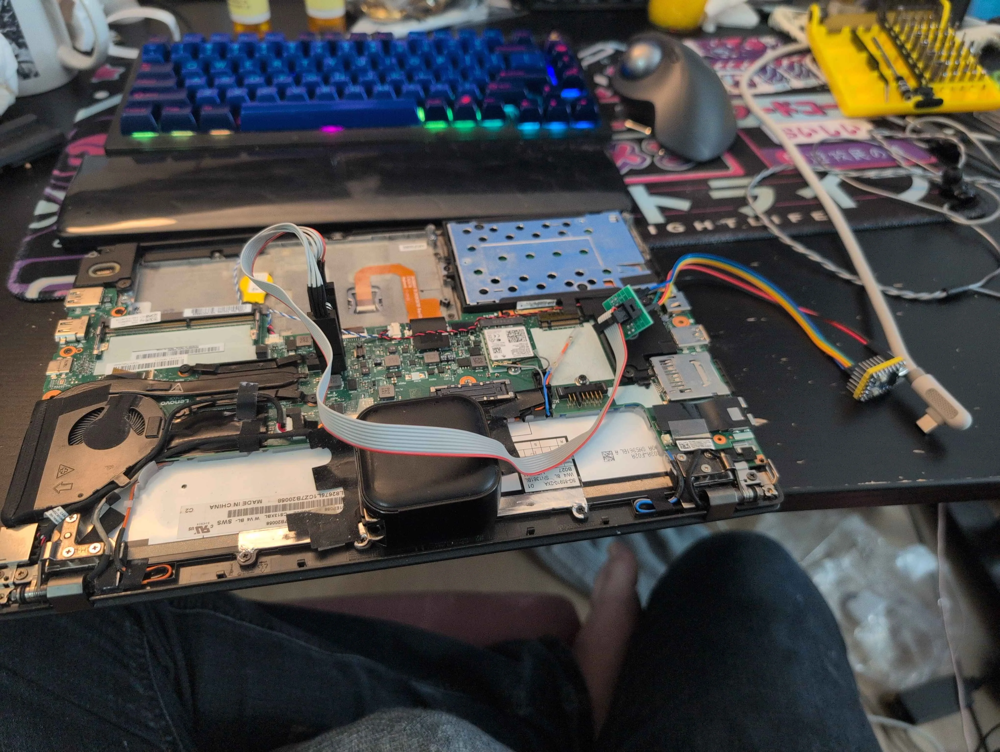

## Trouble strikes

It turns out, in the process of attempting to clip onto the laptop, I knocked off a capacitor.

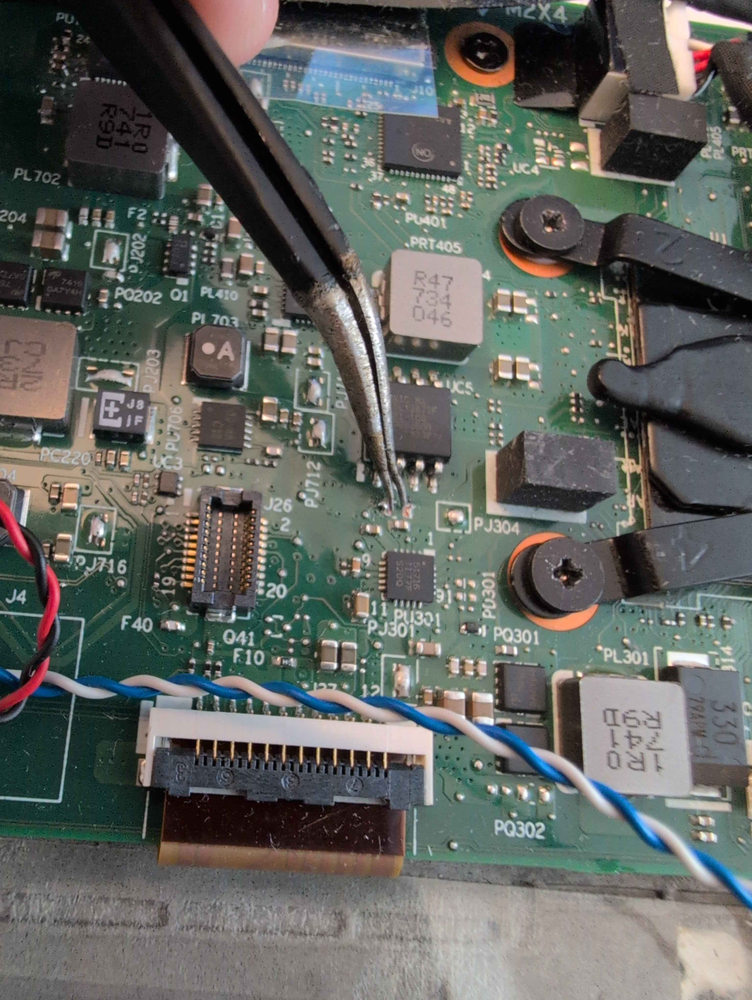

I didn't know what capacitor, either, because trying to resolder it in place, it pinged off of my tweezers ~~into orbit~~ to never be seen again.

### Identification

I used silkscreen markings and referenced a schematic (which I obtained for the purpose of fixing this missing capacitor to begin with) to find the area of the board I had likely damaged. The marking "PJ304" came in helpful.

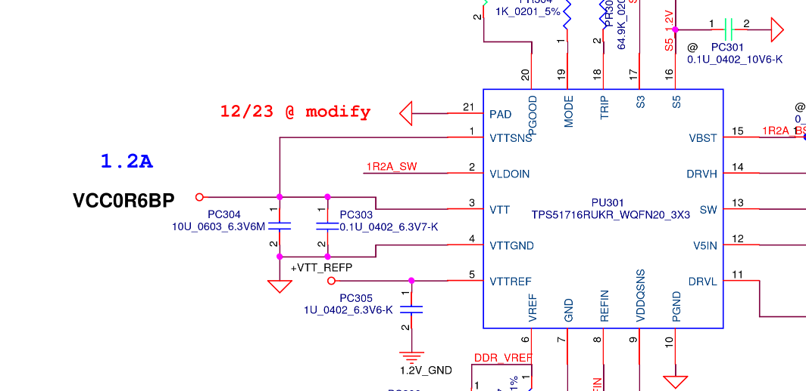

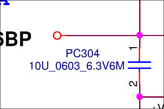

By checking what pin on the chip below the tweezers went to the leads on the capacitor that had been accidentally ripped off and the neighbouring capacitors, it was possible to determine these capacitors were put in parallel between ground and a particular pin of the chip, allowing me to narrow it down to the above.

Digikey, then, comes in clutch at like C$10 for 10 capacitors and next day shipping.

## Back to business, then?

I wanted to make sure that I had something valid so I checked the string content of the flash.

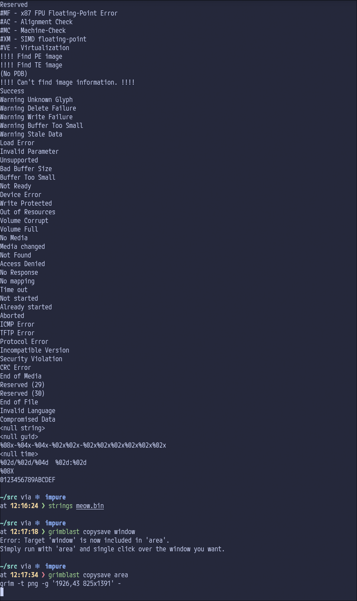

Sure, seems coherent. I then examined the file with ifdtool, using the dump switch.

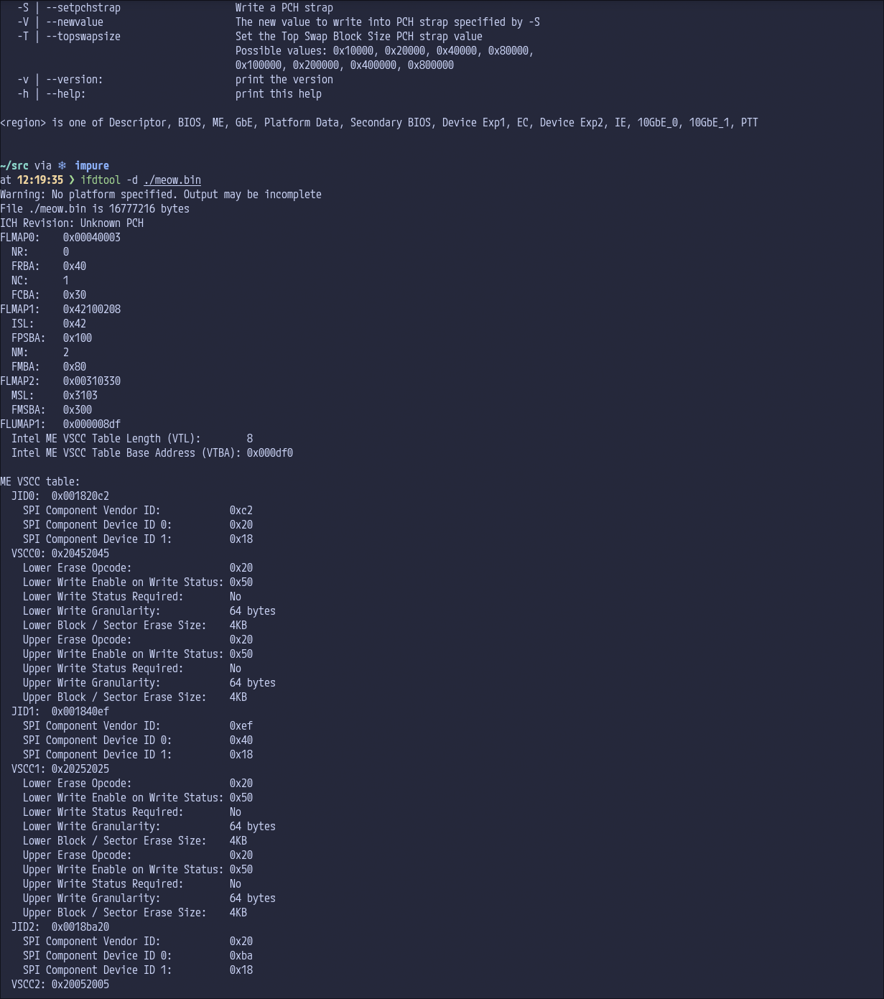

From here, I followed the instructions in the deguard README, producing [this commit](https://codeberg.org/kittywitch/deguard/commit/24479dca9a9fd0030f8a911486837fafbdf1af17) in the process. You can use a patched version of the Intel Management Engine to produce the deltas and this was something prior that was unclear to me, and an interpretation another friend of mine had. It isn't the case that it has to also be vulnerable, at all!

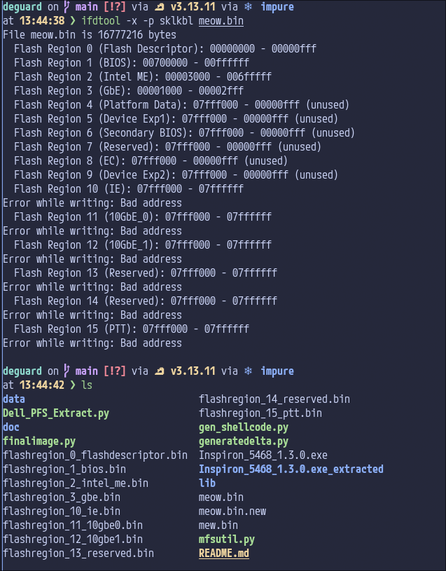

These regions being extracted separately is quite important, the flash descriptor and GbE are both very necessary to produce a final image that functions. I had also tried to figure out how deguard worked being applied to the donor image, to understand the whole system better.

### Differences between the X270 and X280 - part 1

Now, I knew the X280 and X270 differed by two things, initially:

* The X270 lacks Thunderbolt (TBT).
* The X280 has some form of soldered RAM, the X270 has a single SODIMM slot.

We will see some problems later, but initially, basing my work off of the X280 variant, I made changes to it where I disabled the Thunderbolt-related pins (while regarding the official Intel documentation for the generation of chipset; for example one of the TBT pins was thermal management for my machine, so it was fine to set the pin to NONE instead of something more complicated.

I was seeing things lining up on the GPIO pins (gpio.h), aside from the Thunderbolt controller related pins.

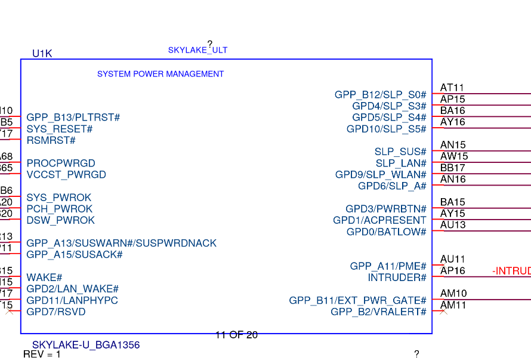
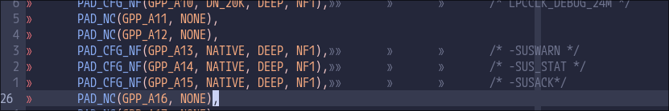

I did notice during this experience, referencing between the X280 and X270 schematics that the MEC1653 was something the X270 had, but the X280 had the MEC1663. This meant that WWAN_DISABLE was one of the only lines coming off of the Wireless section of the MEC1663 on the X280, but there were more lines on the X270 than that. This is unrelated, I just thought it was neat that there were so many different versions of the MEC16xx, lots of derivatives? They all seem well supported by the same MEC1653 driver in coreboot.

I got something to build and then I decided to go to bed for the night.

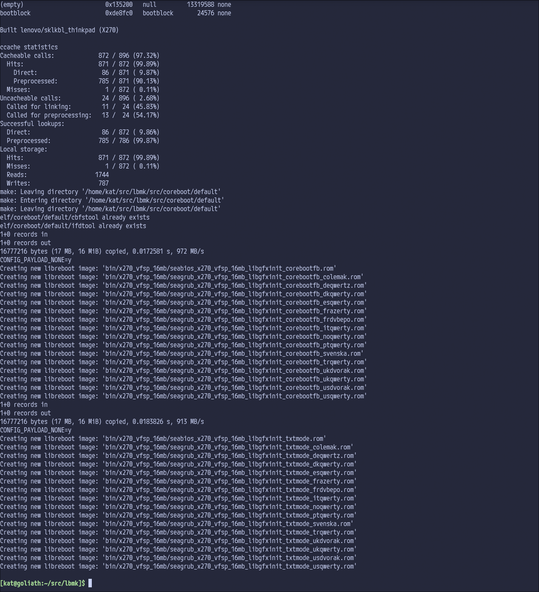

The next day, I went with my wife to pick up my capacitors (I had missed them the day prior, whoops).

### Why can't my board boot off of NVME? Uh oh.

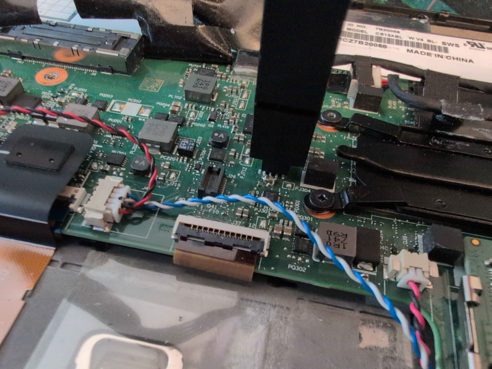

Wow, a suspiciously shitty looking capacitor. To be fair, that is 0.8x1.6mm? It's pretty small. (This was not the only time this capacitor fell off, I had to fix it again afterwards at least 8 attempts of flashing later.)

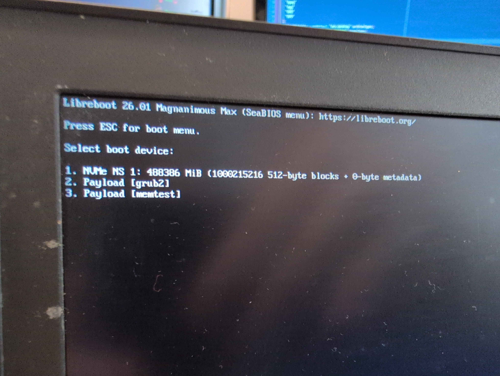
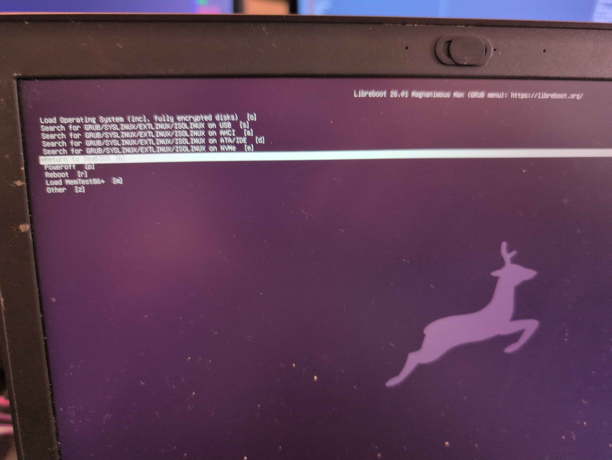

I had something that would actually get to payloads, but when I would select the NVMe NS 1 it would very, very quickly fail out. When I went back to the SeaBIOS menu, I noticed the NVMe NS 1 option then missing. Booting into a LiveUSB, I discovered I had neither the WiFi card or the NVMe present in `lspci`.

I had posted in #libreboot on liberachat a little earlier that I had the X270 booting, however I realized pretty quickly after that it was not all sunshine and rainbows.

#### Asking for help

After a while of talking about the X270 and potential need for upstreaming now, I started speaking about the issue and Leah Rowe, founder of Libreboot (and CanoeBoot and Minifree Ltd) worked with me on attempting to diagnose and fix the problem, producing several ROMs for me given that I potentially may have done things incorrectly. In the end, even with a mostly intact (albeit HAP-bit and Deguarded) Intel Management Engine, it was likely not anything to do with the IME like I was theorizing (I had read an issue for the t470s about being careful with me_cleaner and how truncation caused problems with NVMe and WiFi dropouts. I have to assume this was actually something that could've been mitigated with `--whitelist MFS`).

I'm very thankful for the patience shown towards me, to be frank. ^^;

### Differences between the X270 and X280 - part 2

I was pretty upset by this point, but I woke up to give it a try the next day. At this point, we had figured that the problem was likely to do with PCIe allocations and perhaps the overridetree.cb?

Looking into this and the schematic later in the day together with my wife, I ended up noticing that CLKREQ4 on the X280 schematic led nowhere. On the X270, the WLAN card had two CLKOUT and CLKREQ connections. Looking deeper into this, there was a table showing the separation of the WiGig and WiFi card into two separate PCIe devices despite being contained within the one card. Going down this route, I figured that using CLKREQ1 for WiFi was incorrect and that CLKREQ2 was the appropriate one. Given this, it also made the rest of the CLKREQ selections then further by one, too.

Adjusting for this and regarding the WWAN allocation within the schematic, I made a new build with these adjustments and flashed it. I was greeted with... a working GRUB.

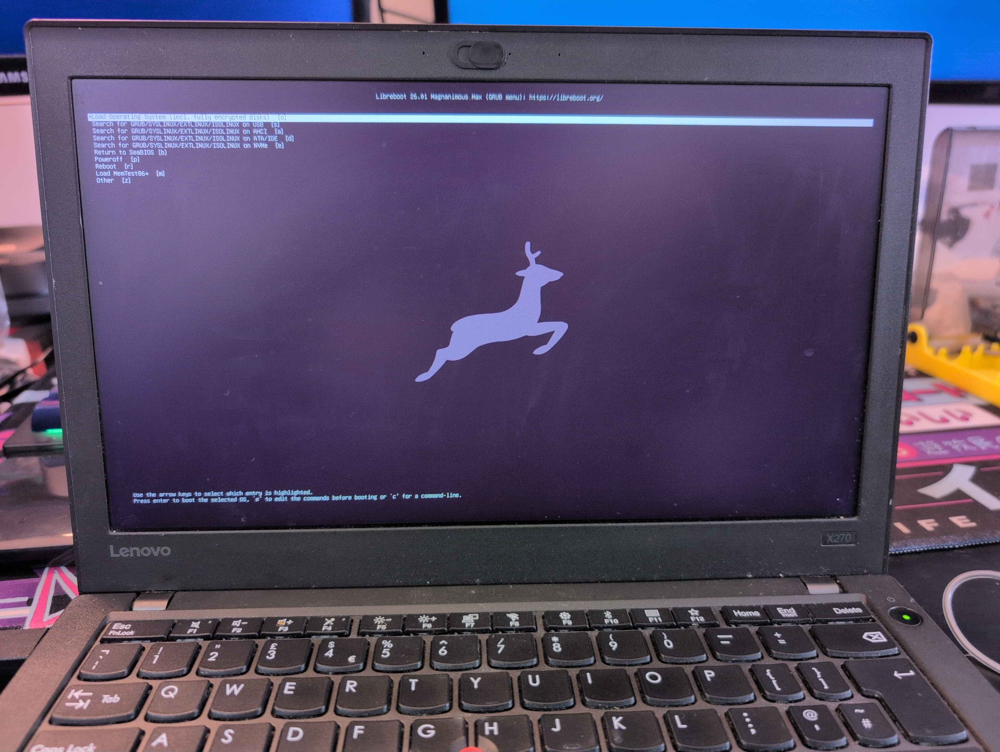

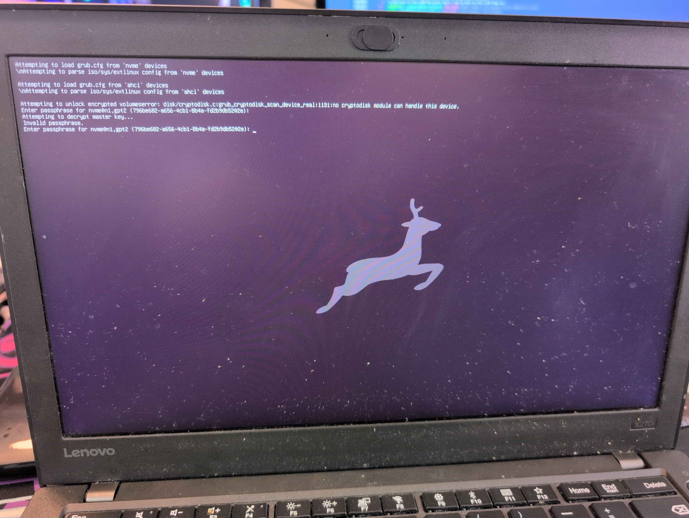

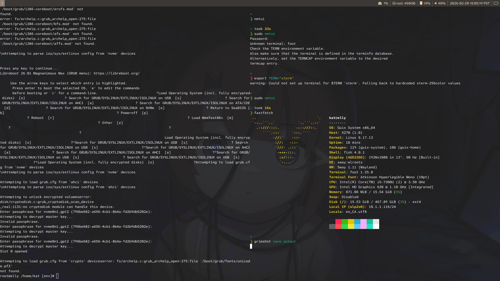

Guix booted and I was able to read `cbmem -1` from within Guix System, showing the Libreboot console log. Wireless (albeit, proprietary) worked! NVMe worked!

## Where from here?

I am starting to upstream my changes:

* [X270 deguard](https://review.coreboot.org/c/deguard/+/91370)
* [X270 coreboot](https://review.coreboot.org/c/coreboot/+/91371)

For the X270 in particular, I got an ath9k wireless dongle so I should now be able to move to linux-libre on my Guix install. I'd like to build it into the laptop if possible in the future through some means and I'll see about doing that, honestly?

I can't recommend [libreboot](https://libreboot.org/) enough, or even [heads](https://osresearch.net/) if libreboot isn't your speed. A big thanks to Leah Rowe for their assistance and the work they have done for libreboot over the years.
